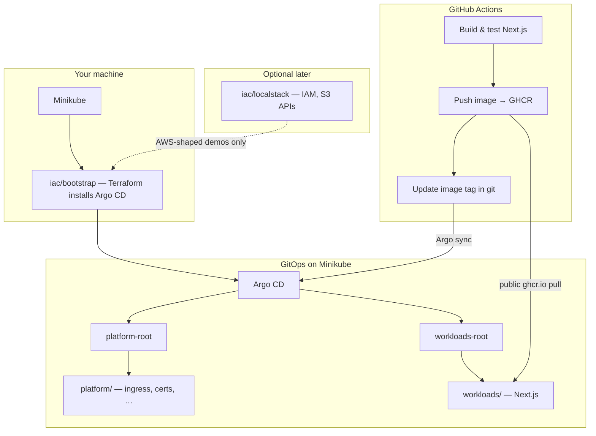

# platform-portfolio

> **Status:** Documentation and layout scaffold only—Minikube, Argo CD, Next.js app, and CI are not implemented yet. See [ADR 0001](docs/adr/0001-local-dev-stack.md) and the [local runbook](docs/runbooks/local-golden-path.md).

End-to-end **platform / SRE portfolio**: optional AWS-shaped IaC → **Minikube** → GitOps (**Argo CD**) → platform services → **Next.js** workload—with CI publishing images to **GHCR**. One clone, one README, one golden path. **$0** for the core path (no real AWS required).

**Remote:** [github.com/cicdpete/platform-portfolio](https://github.com/cicdpete/platform-portfolio)

**Architecture decisions:** [ADR 0001](docs/adr/0001-local-dev-stack.md) (local stack) · [ADR 0002](docs/adr/0002-argocd-roots-and-guardrails.md) (Argo roots & guardrails)  
**Local runbook:** [docs/runbooks/local-golden-path.md](docs/runbooks/local-golden-path.md)

## Problem statement

Demonstrate how a small team can bootstrap a cluster, install a GitOps control plane, roll out shared platform components, and ship an application—with clear **local**, **CI**, and **tear-down** steps suitable for portfolio review (not production hardening).

## Architecture



## Repository layout

| Path | Responsibility |
|------|----------------|
| [`iac/`](iac/) | **Bootstrap:** Terraform installs Argo CD on Minikube. **Optional:** LocalStack-backed AWS resources (IAM, S3)—not Minikube/EKS provisioning in v1. |
| [`platform/`](platform/) | **GitOps:** AppProjects, **`platform-root`** + **`workloads-root`**, platform child apps (ingress, certs, observability). |
| [`workloads/`](workloads/) | **Product:** Next.js app, Helm/Kustomize, Argo `Application` manifests. |
| [`docs/`](docs/) | ADRs, runbooks, destroy checklist. |
| [`.github/workflows/`](.github/workflows/) | CI at **repo root** only (not under `workloads/apps/*/.github/`); `paths` filters per app. |

**Flow:** `minikube start` → `iac/bootstrap` (Argo install) → sync **`platform-root`** and **`workloads-root`** (siblings; see [ADR 0002](docs/adr/0002-argocd-roots-and-guardrails.md)). CI pushes images to GHCR and updates tags in git; Argo deploys on the cluster you run locally.

## Stack

| Layer | Choice | Notes |
|-------|--------|--------|
| Kubernetes | **Minikube** | Local cluster; created via runbook, not Terraform v1 |
| AWS (optional) | **LocalStack** | IAM/S3 API demos in `iac/localstack/` (later); not required for app MVP |
| IaC | **Terraform** | `kubernetes` / `helm` for Argo bootstrap; optional `aws` provider → LocalStack |
| GitOps | **Argo CD** | Bootstrap in `iac/`; ongoing config in `platform/` + `workloads/` |
| Registry (CI) | **GHCR** | `ghcr.io`; public package + public repo → no Actions secrets for MVP |
| Registry (local dev) | **Minikube image load** or `docker-env` | Fast iteration without pushing |
| Ingress / TLS | TBD | e.g. Minikube ingress addon + cert-manager (self-signed / local) |
| Observability | TBD | e.g. kube-prometheus-stack (later) |
| Sample app | **Next.js** hello world | `workloads/apps/` |
| CI | **GitHub Actions** | Build, push GHCR, update git; does not deploy to your laptop |

## Prerequisites

- Git, Docker
- [Minikube](https://minikube.sigs.k8s.io/docs/start/), [kubectl](https://kubernetes.io/docs/tasks/tools/)
- [Terraform](https://developer.hashicorp.com/terraform/install) `>= 1.6`, [Helm](https://helm.sh/docs/intro/install/)
- GitHub account (for CI/GHCR when workflows exist)

## Golden path (summary)

Detailed steps: [docs/runbooks/local-golden-path.md](docs/runbooks/local-golden-path.md). Implementation slices are still landing; commands below show intent.

```bash
git clone https://github.com/cicdpete/platform-portfolio.git
cd platform-portfolio

# Cluster (not Terraform-managed in v1)
minikube start

# One-time Argo CD install
# cd iac/bootstrap && terraform init && terraform apply

# GitOps: sync platform-root and workloads-root (see platform/argocd/)
# argocd app sync platform-root
# argocd app sync workloads-root

# Local app image (optional while developing)
# docker build -t hello-next:local ./workloads/apps/hello-next
# minikube image load hello-next:local

# Tear down
# cd iac/bootstrap && terraform destroy   # if applied
minikube delete
```

**CI path:** push to `main` → Actions builds and pushes `ghcr.io/<owner>/hello-next:<sha>` → manifest tag updated in repo → you `argocd sync` on local Minikube (or auto-sync if enabled).

## Secrets and public repos

- Do **not** commit `.env`, kubeconfigs, or Terraform state with credentials.
- **MVP CI** on a **public** repo can use the built-in `GITHUB_TOKEN` for **public** GHCR—no custom Actions secrets required.
- Add secrets only when needed (private GHCR, Argo token for remote sync, LocalStack auth in CI, real AWS later). Secret **values** are never visible in the repo; see [GitHub encrypted secrets](https://docs.github.com/en/actions/security-guides/using-secrets-in-github-actions).

## Cost and cleanup

- **Core path:** $0 (Minikube local, public Actions + public GHCR).
- **Optional LocalStack:** use free/non-commercial tier if applicable; document auth in runbooks, not in git.
- **Destroy:** `minikube delete`; Terraform destroy for bootstrap; stop any LocalStack compose stack.

## Development

This repo is the workspace root. Prefer small, reviewable diffs; README, ADRs, and runbooks matter as much as code for reviewers.

## License

MIT — see [LICENSE](LICENSE).
